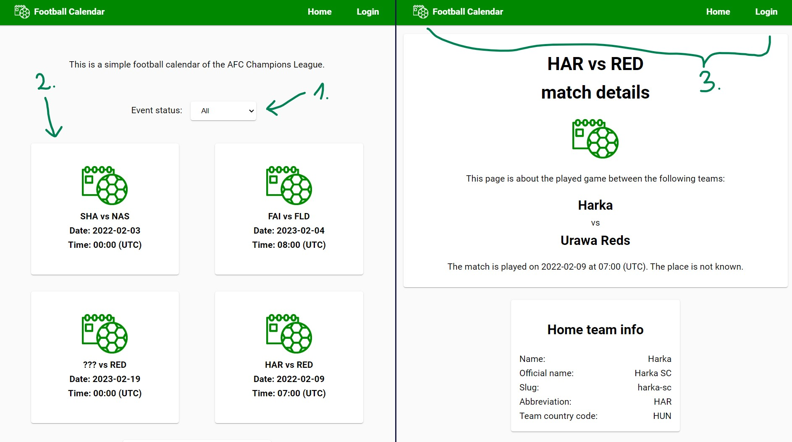
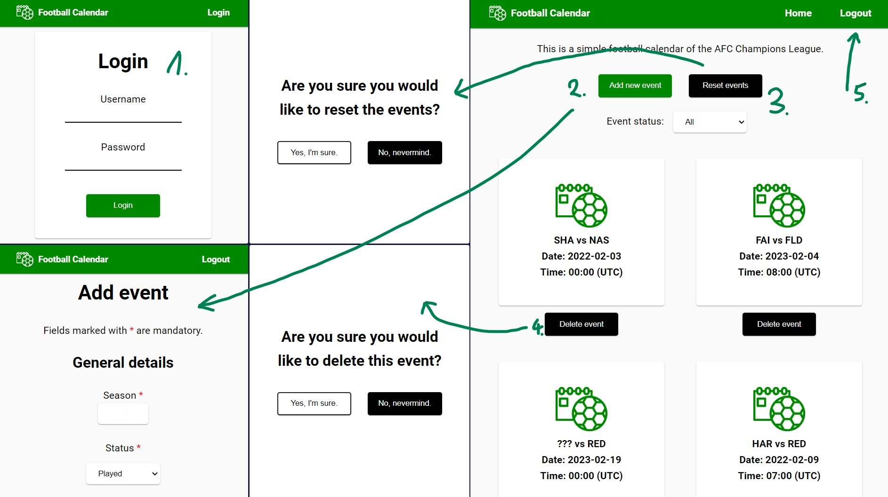
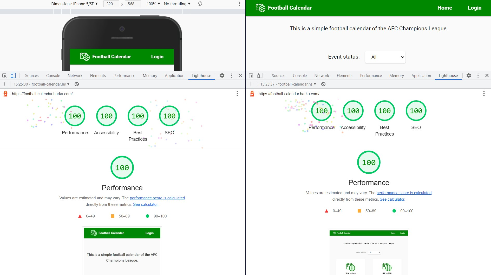

# Football Calendar 

A simple football calendar of the AFC Champions League.

It's single page frontend application with a tiny backend.

Web app: **[football-calendar.harka.com](https://football-calendar.harka.com)**

## Table of contents

Table of contents

- [For visitors](#for-visitors)
- [For admins](#for-admins)
- [For developers](#for-developers)
- [For exercise](#for-exercise)

## For visitors

Visitors are able to use the application in the following way.

1. Events can be sorted with the dropdown menu, to filter for `played`, `scheduled` or `all` games.
2. Details of one particular event can be accessed by selecting one of the calendar cards.
3. Navigation happens using the menu on the top. It's possible to go back to the home page or to log in if the visitor is an admin.

Registration is not allowed as only the maintainers should have permission to add, delete or reset events, but the username `admin` and the password `@dm1n` can be used for testing purposes for now.

[Top ↑](#top)

[Top ↑](#top)

## For admins

Admins are allowed to perform the below actions in addition to the ones already mentioned above.

1. Maintainer tools can be accessed by logging in.
2. A new event can be added with the `Add new event` button.
3. Events can be reset to their original state with the `Reset events` button, if the choice is confirmed.
4. Events can be deleted with the `Delete event` buttons. This choice needs to be confirmed as well.
5. It is advised to log off with the `Logout` button after using the admin profile, because the application remembers the user logon state and it will be logged in the next time the application is opened.

[Top ↑](#top)

[Top ↑](#top)

## For developers

Developers might find the below information interesting about this frontend SPA with a tiny backend.

**Frontend:** It is written using plain HTML for the structure and the style is coded in SCSS, which compiles to CSS. The HTML is rendered without any frameworks or libraries, but by using vanilla JavaScript. The `XMLHttpRequest` object is utilized for sending and receiving requests to and from the server. All the frontend files are hosted on and served from Cloudflare Pages.

**Backend:** It is a tiny node.js server written in native JavaScript, without any frameworks or libraries. The `http` module is used to receive and send requests from and to the client. The `fs` module is also used to read and edit the events' data in the server's JSON files. All the backend files are deployed to and running on CodeSandbox.

**Database:** Not a proper database actually, but JSON files are used to store the app's data.

**Performance:** The main goal was to make the app as performant as possible. Lighthouse for Google Chrome was used to check the app's performance on mobile (left) and desktop (right). The below image might be a good indicator whether the goal was achieved or not.

[Top ↑](#top)

[Top ↑](#top)

## For exercise

This project was born for a coding challenge according to [**this**](https://github.com/MrDanielHarka/football-calendar/blob/main/documentation/frontend-challenge-sportradar.pdf) document.
